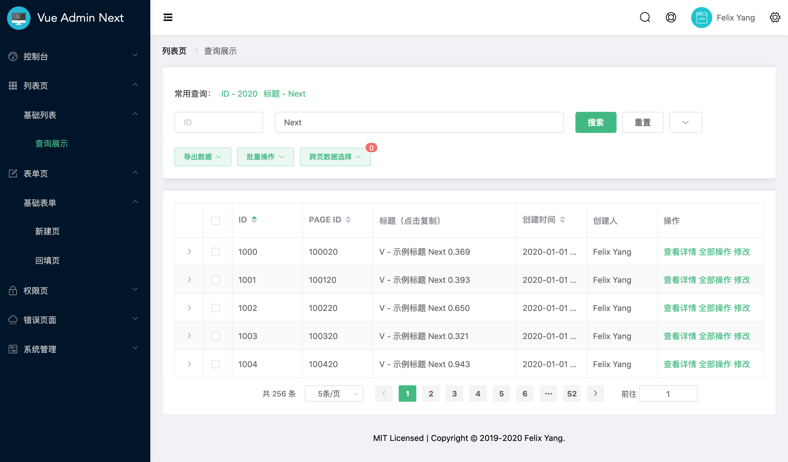

# Vue Admin Next

Professional enterprise application with **Vue Composition API**, **Multi-Module Design**, **Data Processing Flow**, and **Friendly User Interface**. Now is ready for production environment.

> **Note**: When the official version of Vue 3.0 is released, this project will be migrated as soon as possible!

:us: English | [:cn: 简体中文](README.zh-CN.md)

## Features

- ✨Vue Composition API
- ✨Multi-Module Design
- ✨Data Processing Flow
- ✨Friendly User Interface
- ✨Best Practices

## Quick Start

### Fork

[⚡ Fork Repository](https://github.com/openfext/vue-admin-next/fork)

### From Template

[⚡ Generate Vue Admin Next](https://github.com/openfext/vue-admin-next/generate)

## Example

[Vud Admin Next Preview](https://openfext.github.io/vue-admin-next/#/table/basic/query)

## Docs

### 🇨🇳 Chinese

- [Introduction](https://openfext.github.io/docs/vue-admin-next/intro.html)
- [Guide](https://openfext.github.io/docs/vue-admin-next/guide/start.html)
- [API Reference](https://openfext.github.io/docs/vue-admin-next/api/component.html)

### 🇺🇸 English

WIP...

## Contacts

Welcome to join the group chat to discuss project issues and front-end technologies 💬

### QQ

ChatID: 667576147

### WeChat Group

Add the author's WeChat to get into the group:

## Built With

- [Vue.js](https://github.com/vuejs/vue)
- [Vue Use](https://github.com/openfext/vue-use)
- [ElementUI](https://github.com/ElemeFE/element)

## License

[MIT](http://opensource.org/licenses/MIT)

Copyright (c) 2020 - present, Felix Yang
